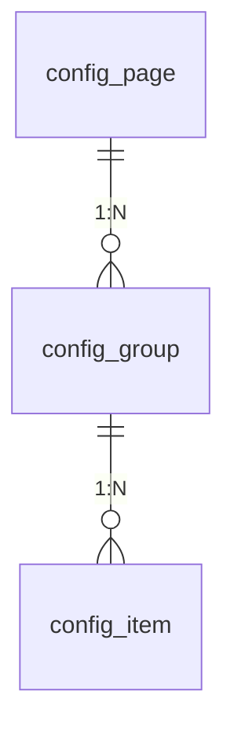
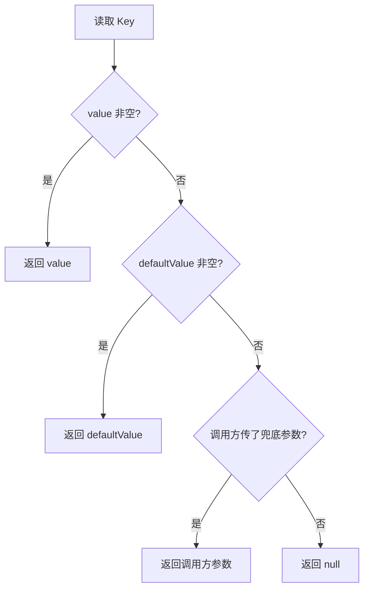
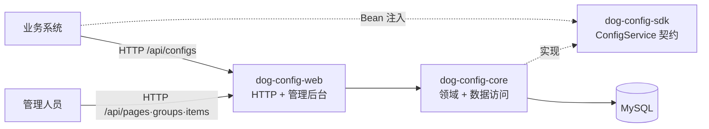

# dog-config · 业务通用配置管理系统

> 把散落的业务配置（订单超时、超卖开关、默认物流商……）收进一个 **Page → Group → Item** 三级模型统一管理；业务代码只认一个稳定的 **Key**，即可类型化读取。
>
> 适合「不想为改一个配置而发版」的团队；它**不是**应用运行时配置中心（见下）。

## 这是什么

业务系统里总有大量「可调的业务开关和参数」：订单超时时间、是否允许超卖、默认物流商、库存预警值……它们散落在各处的常量、数据库字段或硬编码里，改一次要发版，查一处要找半天。

dog-config 把它们收进来集中管理，并给业务方一个**类型化、带兜底**的读取接口。

**它不是什么：** 它不是 Nacos / Apollo 这类应用运行时配置中心。dog-config 管的是**业务通用配置**，形态是「管理人员在后台维护，业务代码按 Key 读取」，不负责应用自身的启动配置、也不做实时推送。

## 核心模型



结构示例：

```
Page（页面 / 业务域）        例：订单配置 ORDER
  └── Group（分组）          例：自动取消 AUTO_CANCEL
        └── Item（配置项）     key = order.auto.cancel.minutes
                              valueType = INTEGER
                              value = 30 / defaultValue = 30
                              componentType = NUMBER
```

- **Page** 用 `code` 标识一个业务域，全局唯一。
- **Group** 归属于某个 Page，`(page_id, code)` 唯一，用于给配置分组。
- **Item** 归属于某个 Group，`key` **全局唯一**——这是业务代码读取时唯一需要记住的东西。
- 每个 Item 声明 `valueType`（如何解析）、`componentType`（后台如何渲染）、`value` / `defaultValue`（原始字符串）与 `options`（下拉选项）。

## 功能特性

- **三级模型 CRUD**：Page / Group / Item 的增删改查、启停（ACTIVE / DISABLED）、排序。
- **6 种值类型**：`STRING` / `INTEGER` / `LONG` / `DECIMAL` / `BOOLEAN` / `JSON`。
- **6 种组件类型**：`INPUT` / `NUMBER` / `SWITCH` / `SELECT` / `RADIO` / `TEXTAREA`，驱动后台渲染。
- **默认值兜底**：`value` 为空时自动回落到 `defaultValue`。
- **读取 API**：单条 / 批量 keys / 前缀批量。
- **类型化 SDK**：业务系统引入 `dog-config-sdk`，用 `getInt` / `getBoolean` / `getJson` 等直接拿到强类型值。
- **管理后台**：原生 HTML/JS 静态页，无前端构建链。
- **软删除**：删除使用 `deleted` 列标记，保留审计痕迹。

## 快速开始

前置：**JDK 17**、**Maven 3.8+**、**本地 MySQL**（默认账号 `admin/123456`，可在 `dog-config-web/src/main/resources/application.yml` 修改）。

> 注意：主应用**不会**自动建表（`spring.sql.init.mode: never`），必须先手动初始化数据库。

```bash
# 1. 建库
mysql -uadmin -p123456 -e "CREATE DATABASE dog_config CHARACTER SET utf8mb4"

# 2. 建表 + 种子数据（订单 / 商品 / 物流示例配置）
mysql -uadmin -p123456 dog_config < dog-config-web/src/main/resources/db/schema.sql
mysql -uadmin -p123456 dog_config < dog-config-web/src/main/resources/db/data.sql

# 3. 编译并安装到本地仓库（core / sdk 需先安装）
mvn install

# 4. 启动（端口 8080）
mvn -pl dog-config-web spring-boot:run
```

> 完整 DDL 见 `dog-config-web/src/main/resources/db/schema.sql`（`config_page` / `config_group` / `config_item` 及索引、外键）；种子数据见同目录 `db/data.sql`。

启动后：

- 管理后台：http://localhost:8080/
- 读取接口：`GET http://localhost:8080/api/configs/order.auto.cancel.minutes`

## 使用方式

### 方式一：SDK（Java 业务系统推荐）

```xml
<dependency>
    <groupId>com.echozoo</groupId>
    <artifactId>dog-config-sdk</artifactId>
    <version>0.1.0</version>
</dependency>
```

```java
@Autowired
ConfigService configService;

Integer minutes     = configService.getInt("order.auto.cancel.minutes");        // 30
Boolean overSell    = configService.getBoolean("order.allow.over.sell");        // false
String  channel     = configService.getString("logistics.default.channel", "SF"); // 带兜底参数
BigDecimal rate     = configService.getDecimal("order.fee.rate");
OrderRule rule      = configService.getJson("order.rule", OrderRule.class);      // JSON 反序列化
Map<String, Object> batch  = configService.getBatch(List.of("order.timeout", "product.stock.warning"));
Map<String, Object> prefix = configService.getByPrefix("order.");
```

### 方式二：HTTP 读取接口

```bash
GET /api/configs/{key}          # 单条
GET /api/configs?keys=a,b,c     # 批量 keys
GET /api/configs?prefix=order.  # 前缀批量
```

统一响应体（业务错误也返回 HTTP 200，用 `code` 表达）：

```json
{ "code": 0, "message": "ok", "data": 30 }
```

### 管理 API

| 资源 | 端点 |
| --- | --- |
| Page | `GET/POST /api/pages`，`GET/PUT/DELETE /api/pages/{id}`，`PATCH /api/pages/{id}/status` |
| Group | `POST /api/pages/{pageId}/groups`，`GET /api/pages/{pageId}/groups`，`GET/PUT/DELETE /api/groups/{id}`，`PATCH /api/groups/{id}/status` |
| Item | `POST /api/groups/{groupId}/items`，`GET /api/groups/{groupId}/items`，`GET/PUT/DELETE /api/items/{id}`，`PATCH /api/items/{id}/status`，`PATCH /api/items/{id}/value` |

错误码：`40000` 参数校验失败 / `40400` 资源不存在 / `40900` 唯一性冲突 / `50000` 服务器内部错误。

## 读取语义（稳定契约）

```
value 非空                      → 使用 value
value 空，defaultValue 非空     → 使用 defaultValue（DB 集中兜底）
value 空，defaultValue 空       → 带参重载返回调用方传入参数；无参重载返回 null
```



这条语义是业务依赖的稳定契约，不会随功能迭代改变。

## 设计思想

若只想搬走这套思路，记住以下几点即可（完整决策见 [`doc/design/design-decisions.md`](doc/design/design-decisions.md)）：

- **三级模型，只有 Item 参与契约**：Page / Group 只负责组织与展示；业务访问的稳定契约是 Item 的 `key`。
- **Key 即契约**：业务代码只认 key，配置怎么分组、怎么改名都不影响读取。
- **字符串存储 + 类型解析**：`value` / `defaultValue` 一律按字符串存，读取时按 `valueType` 解析——一个列适应所有类型，DB 结构稳定。
- **兜底链**：`value → defaultValue → 调用方参数 / null`，默认值集中在 DB 管理，调用方还能再兜一层。
- **分层解耦**：契约在 `sdk`、实现在 `core`、HTTP 在 `web`，业务系统只依赖 `sdk` 即可类型化读取。
- **软删除与业务态分离**：`deleted` 由框架维护（保留删除痕迹），`status`（ACTIVE / DISABLED）是业务开关。

## 模块结构



```text
dog-config/
├── dog-config-sdk/   # 独立 SDK：只定义 ConfigService 读取契约，不含实现
├── dog-config-core/  # 领域模型 + MyBatis-Plus Mapper + ConfigService 实现
└── dog-config-web/   # Spring Boot 启动器 + 管理 API + HTTP 读取接口 + 静态后台
```

依赖方向：`core → sdk`，`web → core + sdk`。接口契约只定义在 `sdk`，实现放 `core`，`web` 只做 HTTP 暴露。

技术栈：Java 17 · Spring Boot 3.3.5 · MyBatis-Plus 3.5.7 · MySQL · 原生 HTML/JS。

## 换数据库 / 魔改数据访问层

持久化基于 MyBatis-Plus，业务逻辑与具体数据库无关。**要换库，只需动下面 5 处**：

| # | 位置 | 要改什么 |
| --- | --- | --- |
| 1 | `dog-config-web/pom.xml` | 把 `com.mysql:mysql-connector-j` 换成目标库 JDBC 驱动 |
| 2 | `dog-config-web/src/main/resources/application.yml` | `spring.datasource.url` 与 `driver-class-name` |
| 3 | `db/schema.sql` | DDL 方言：`AUTO_INCREMENT`、`TINYINT(1)`、反引号（`` `key` `` / `` `value` ``）、`TEXT`、`DATETIME` |
| 4 | `db/data.sql` | 种子方言：`INSERT IGNORE`、`NOW()` |
| 5 | `dog-config-core/.../mapper/*Mapper.java` | 3 个 Mapper 内的自定义 SQL：反引号与 `LIMIT 1` |

其余部分——实体、Mapper 接口、Service 逻辑、读取语义——**与数据库无关，无需改动**。

排查方法：全局搜索**反引号**、`LIMIT`、`driver`、`AUTO_INCREMENT`，逐一按目标库方言替换。注意 `key` / `value` 是保留字（本仓库用反引号规避，换库需改成对应引用符）。

细节与完整清单见 [`doc/design/database-design.md`](doc/design/database-design.md#7-换数据库魔改数据访问层)。

## 当前状态

| 状态 | 内容 |
| --- | --- |
| ✅ 已完成 | v0.1 基础：Page/Group/Item CRUD 与启停、6 种值类型、6 种组件类型、options、读取 API（单条/批量/前缀）、类型化 SDK、管理后台、种子数据 |
| ✅ 已完成 | `harden-config-writes`：写入值/选项/组件校验、必填约束、软删感知的唯一性 409、父级删除保护 |
| ✅ 已完成 | `config-item-versioning`：配置值版本记录、版本查询、回滚、软删恢复 |

进度以 `openspec/changes/` 为准（`openspec list` 可查看）。

## 路线图

目标：让别人**一眼看懂它是什么、觉得有用，然后 fork 魔改或直接套用这套设计思想**。所以路线图围绕「看懂 → 跑起来 → 改得动」推进，而不是堆功能。

### 已完成

- 首屏可视化：整体架构图、Page → Group → Item 模型图、读取语义流水线（Mermaid，不用截图）
- 说清「解决什么问题 / 不解决什么问题」，避免与 Nacos / Apollo 混淆
- 「设计思想」摘要（链接 `doc/design/design-decisions.md`）
- 「换数据库 / 魔改数据访问层」指南：5 处 touchpoint + 完整 DDL 与执行步骤

### 下一步 — 读得懂、改得动

- 关键代码路径标注扩展点；给出常见改造示例（换存储、加值类型等）作为参考

### 之后 — 用得踏实

- 基础 CI（构建 + 测试徽章）

### 暂不纳入

- 发布到 Maven 中央仓库、多租户、RBAC、审批、灰度、实时推送 / MQ
- Docker Compose / H2 demo（改用「完整 DDL + 执行步骤 + 换数据库指引」）
- 这些属于「产品化 / 便捷化」能力，谁需要谁在自己的 fork 里加

## 文档与规格

项目采用 **Spec-Driven Development**，规格与变更记录统一在 `openspec/`：

| 位置 | 内容 |
| --- | --- |
| `openspec/specs/` | 能力规格（canonical，随实现沉淀） |
| `openspec/changes/` | 进行中的变更（proposal / design / specs / tasks） |
| `openspec/changes/archive/` | 已归档变更 |
| `doc/product/v0.1/` | 业务通用配置管理系统需求规格说明书 v1.0 |
| `doc/design/` | 设计文档（数据库 / API / 模块结构 / 设计决策） |

## 开发与贡献

- **流程**：先确认 `openspec/` 中的规格再实现，范围以 change 为界。新功能用 `openspec new change <name>` 起一个变更，按 proposal → design → specs → tasks 推进，完成后归档。
- **分层**：接口契约只改 `dog-config-sdk`，实现放 `dog-config-core`，`web` 只做 HTTP 暴露。
- **持久化**：数据库结构变更需同步 `db/schema.sql`；软删除统一用 `@TableLogic`（`deleted` 列）。
- **测试**：`core` 用 Mockito 单元测试；`web` 用 `@SpringBootTest + MockMvc` 集成测试，连本地 MySQL `dog_config_test`（自动建库、事务回滚）。
- **收尾**：提交前运行 `mvn install`，确保全模块与测试通过。

## License

本项目采用 [MIT License](LICENSE)。
